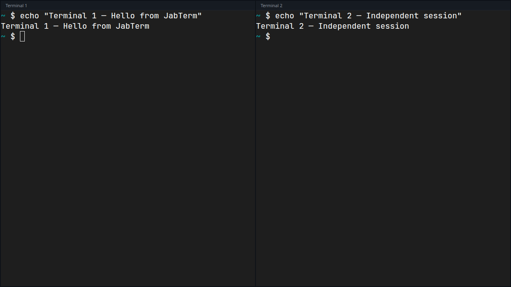
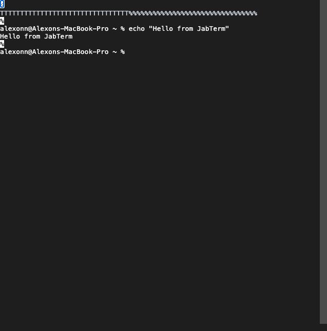
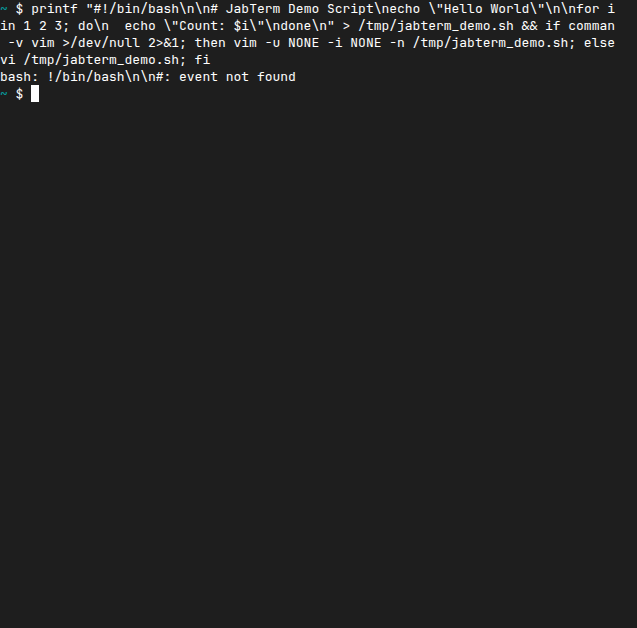

# JabTerm

**Just Another Browser Terminal** — drop-in React component + Node.js server for embedding real terminals in web apps.



## Features

- Single `<JabTerm>` React component — no wrapper overhead, no built-in tabs
- Multiple independent terminals on one page without conflicts
- Node.js server powered by `node-pty` — real shell, real colors
- Same-origin WebSocket proxy for HTTPS / Cloudflare / tunnel deployments
- CLI binary: `npx @jabterm/server --port 3223`

## Quick Start

### 1. Install

```bash
pnpm add @jabterm/server @jabterm/react
```

### 2. Start the server

```bash
npx @jabterm/server --port 3223
```

Or programmatically:

```typescript
import { createTerminalServer } from "@jabterm/server";

const server = await createTerminalServer({ port: 3223 });
// server.close() to shut down
```

### 3. Render the component

```tsx
import { JabTerm } from "@jabterm/react";
import "@jabterm/react/xterm.css";

function App() {
  return (
    <div style={{ width: "100%", height: 400 }}>
      <JabTerm wsUrl="ws://localhost:3223" />
    </div>
  );
}
```

## Multiple Terminals

Each `<JabTerm>` opens its own WebSocket connection and PTY process.
They are fully independent:

```tsx
<div style={{ display: "flex", gap: 8, height: 400 }}>
  <JabTerm wsUrl="ws://localhost:3223" />
  <JabTerm wsUrl="ws://localhost:3223" />
</div>
```

## Screenshots

| Echo command | nano TUI editor |
|---|---|
|  |  |

*Screenshots are auto-updated by CI on every push to `main`.*

## API Reference

### `<JabTerm>` Props

| Prop | Type | Default | Description |
|------|------|---------|-------------|
| `wsUrl` | `string` | *required* | Full WebSocket URL (`ws://` or `wss://`) |
| `onTitleChange` | `(title: string) => void` | — | Fires when the shell sets a window title |
| `className` | `string` | — | CSS class for the outer container |
| `fontSize` | `number` | `13` | Font size in pixels |
| `fontFamily` | `string` | system monospace | Font family |
| `theme` | `{ background?, foreground?, cursor? }` | `{ background: "#1e1e1e" }` | xterm.js theme overrides |

### `createTerminalServer(options?)`

```typescript
const server = await createTerminalServer({
  port: 3223,         // default: 3223
  host: "127.0.0.1",  // default: 127.0.0.1
  shell: "/bin/zsh",   // default: /bin/zsh (macOS/Linux), powershell.exe (Windows)
  cwd: "/home/user",   // default: $HOME
  strictPort: false,   // default: false — fail if port is busy
});
```

Returns `{ wss, port, close() }`.

### `createTerminalProxy(options)`

Creates a `WebSocketServer` in `noServer` mode for same-origin proxying:

```typescript
import { createTerminalProxy } from "@jabterm/server";

const proxyWss = createTerminalProxy({
  upstreamUrl: "ws://127.0.0.1:3223",
});

httpServer.on("upgrade", (req, socket, head) => {
  if (new URL(req.url, "http://localhost").pathname === "/ws/terminal") {
    proxyWss.handleUpgrade(req, socket, head, (ws) => {
      proxyWss.emit("connection", ws, req);
    });
  }
});
```

## Architecture

See [docs/ARCHITECTURE.md](docs/ARCHITECTURE.md) for internals, data flow diagrams, and protocol description.

## License

MIT
