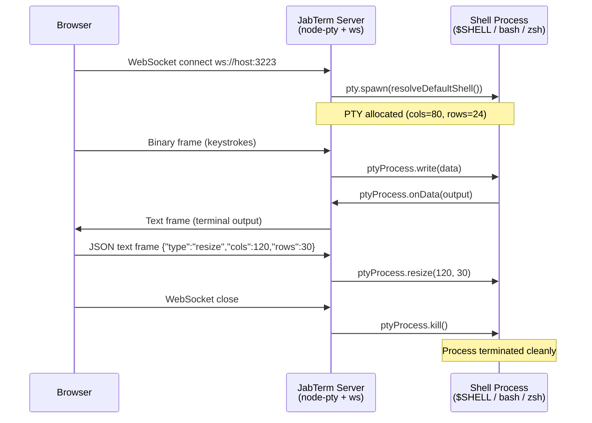

# JabTerm Architecture

## Overview

JabTerm is published as a single package with two subpath entry points:

- **`jabterm/server`** — Node.js WebSocket server that spawns PTY processes via `node-pty`
- **`jabterm/react`** — React component that renders xterm.js and connects to the server

## Data Flow — Direct Mode

In development or local HTTP setups, the browser connects directly to the terminal server:

## Data Flow — Proxy Mode

For HTTPS, Cloudflare Tunnels, or reverse-proxy setups, the browser connects to the
app server on the same origin, which bridges to the local terminal server:

## Protocol

JabTerm uses a simple multiplexed protocol over a single WebSocket connection:

### Frame Types

| Direction | Frame Type | Content | Purpose |
|-----------|-----------|---------|---------|
| Client -> Server | Binary | Raw bytes | Terminal input (keystrokes) |
| Client -> Server | Text (JSON) | `{"type":"resize","cols":N,"rows":N}` | Resize PTY |
| Server -> Client | Text | Raw terminal output | Display in xterm.js |

### Control Message Detection

The server uses a heuristic: if a text frame starts with `{`, it attempts to parse it as JSON.
If parsing succeeds and `type === "resize"`, it is treated as a control message.
Otherwise, the frame is written to the PTY as input.

### Resize Safety

Minimum dimensions are enforced (`cols >= 10`, `rows >= 10`) to prevent shell crashes from
zero-dimension resize calls.

## Component Lifecycle

## Graceful Shutdown

The server tracks all spawned PTY processes in a `Set<IPty>`.

On `SIGTERM` / `SIGINT`:
1. All tracked PTY processes are killed
2. The WebSocket server is closed
3. A 2-second fallback `setTimeout` ensures the process exits even if `wss.close()` hangs

This prevents zombie shell processes when the server is stopped (e.g., during CI teardown
or when Playwright finishes tests).

## Proxy Bridge Details

`createTerminalProxy()` returns a `WebSocketServer` in `noServer` mode. The caller is
responsible for routing HTTP upgrade requests to it.

The bridge:
- Buffers up to 100 frames while the upstream connection is still `CONNECTING`
- Replays buffered frames once upstream reaches `OPEN`
- Mirrors `close` and `error` events in both directions
- Normalizes WebSocket close codes (strips reserved codes like 1005, 1006, 1015)
- Truncates close reasons to 123 bytes (WebSocket spec limit)
